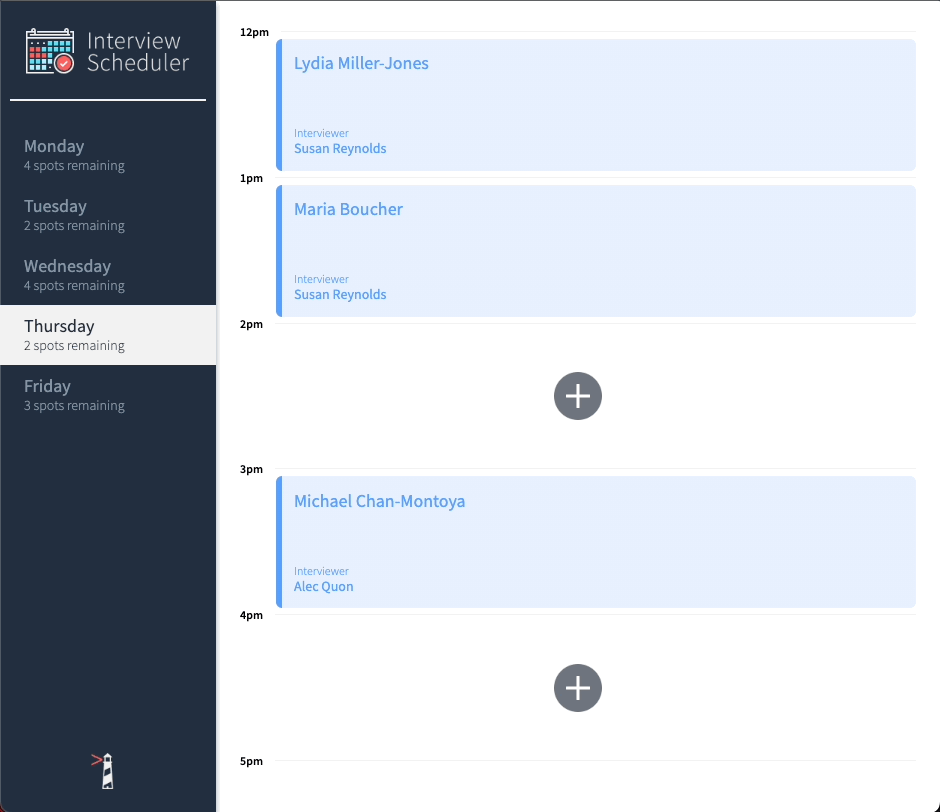
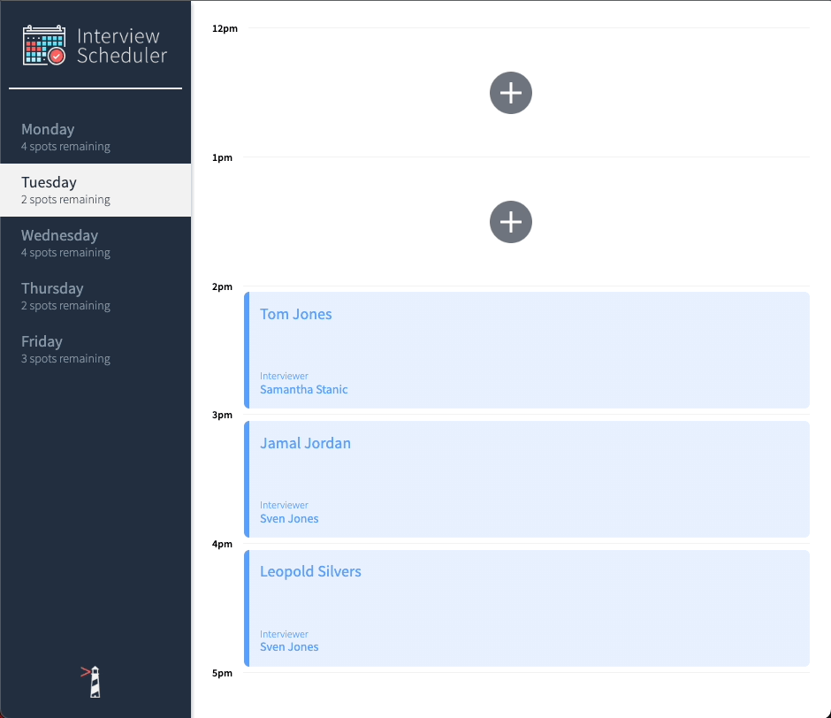
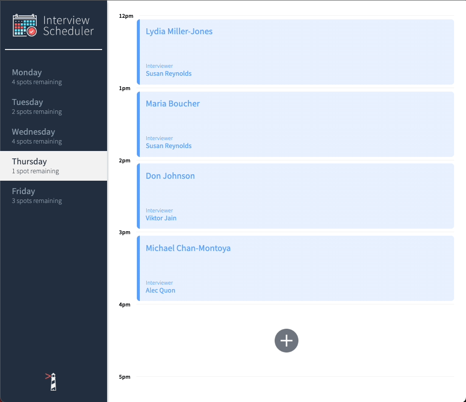

# Interview Scheduler

Welcome to Interview Scheduler, a React app for managing bookings. It was created using Storybook to initially create the components along with the Jest and Cypress testing frameworks to ensure a high level of confidence in the code. 

Users can choose a day from the sidebar which dynamically displays the amount of interview spots remaining. As seen in the screenshots below, users are able to add, edit or delete their appointnment.  

## Setup

Install dependencies with `npm install`.

## Running Webpack Development Server

```sh
npm start
```

## Running Jest Test Framework

```sh
npm test
```

## Running Storybook Visual Testbed

```sh
npm run storybook
```

## Running Cypress Test Framework
```sh
npm run cypress
```

## Screenshots

### Adding an Appointment

### Editing an Appointment

### Deleting an Appointment



